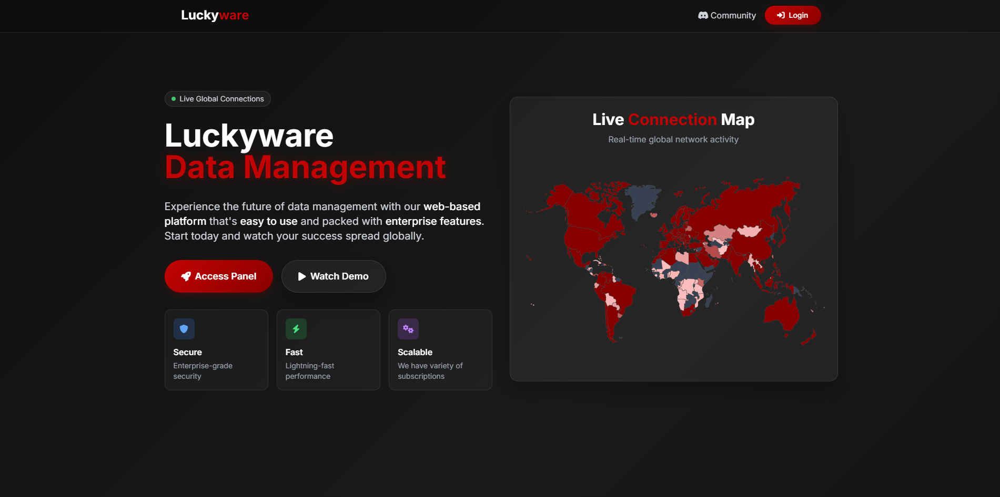
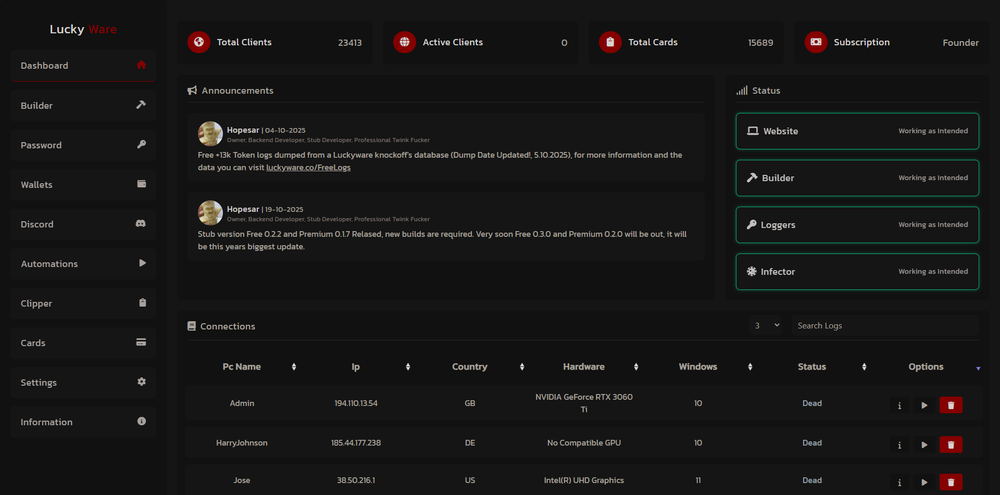

# Luckyware
Luckyware is considered one of the early examples of web-based RAT and keylogging tools that was widely used in Fortnite, Valorant and many more cheating community's due to its source infector capabilitys, and this October 2025 source is shared only for educational insight. 
It is intended for studying malware and security research, not for use or deployment. Unauthorized usage is strictly discouraged.

This source is just for you to learn and maybe paste parts from. Im pretty sure no one can possibly get Luckyware fully up and running again without my help or some major recoding.

The Database included is empty, only has essentials to run Luckyware. The original Database that contains the millions of data logged throughout the years will be kept private, wont be sold or posted anywhere. 
Thank you everyone for helping me grind millions of data!

# Photos from the site:

